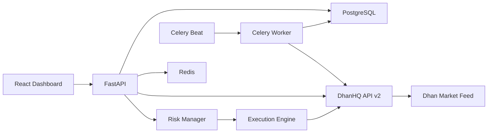

# Architecture

## Flow

1. Pre-market sync loads symbols and recent candles.
2. Market scanner filters Nifty 50 names by absolute move >= 2%.
3. Option selector checks CPR, VWAP, momentum, volume, spread, OI, and abnormal candles.
4. Breadth engine classifies market as positive, negative, or sideways from ATM CE/PE CPR-bottom checks.
5. Breakout engine watches 9:15 to 9:25 range on 5 minute candles.
6. Risk manager sizes quantity from allowed rupee risk and stop distance.
7. Execution engine places market buy and immediately places stop-loss limit sell.
8. Daily analytics stores candidates, trades, PnL, and equity snapshots.
